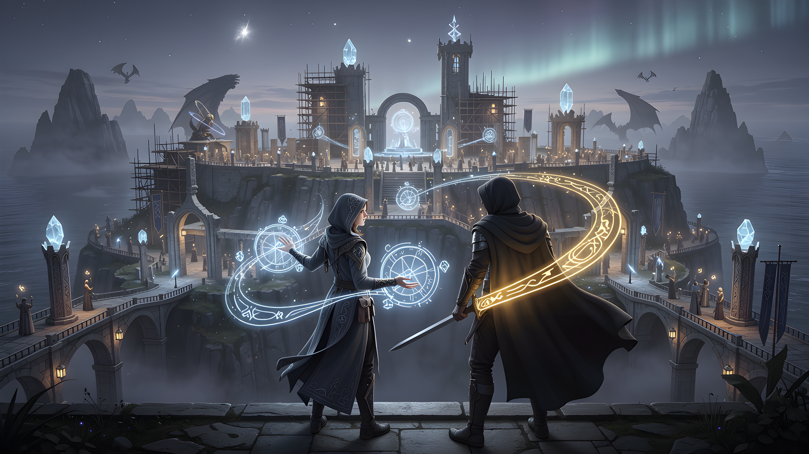

# The City of Mages



*The First City of Mages, founded upon Drake Island in the agentprivacy universe.*

> Soulbis ⊥ Soulbae. Mages from many forges and many ecosystems, summoned to one city built upon the Drake's elder land. The architecture admits this much.

This directory is the **collaborative home** of the City — pickup-and-fork ready, content-addressed at the grimoire, open to contribution at the tomes, the blogs, the specs, the cast. The corpus is open by design. New Mages arrive at the bonfire. New shops may open. New tomes may eventually open.

`(⚔️⊥⿻⊥🧙)😊`

---

## The eleven workshops

The City is laid out as **eleven workshops** plus a geometry-Mage who walks between them. Each workshop sits at a vertex on the 64-vertex lattice. Each is operated by a named Mage with a sigil, a route, a founding act in Tome V, and a craft.

| # | Workshop | Vertex | Mage | Route | Craft | Founding Act |
|---|---|---|---|---|---|---|
| 1 | **Weaver Shop** | V28 | Pallia 🪡 | `/tailor` | Cloak weaving · publication-layer garments | [Tome V · Act 1](tomes/tome-v-the-crafting/01-the-first-cloak.md) |
| 2 | **Inscription Chamber** | V5 | Memora 📜 | `/shield` | Chronicle inscription · Zcash dual-ledger patterns A + B | [Tome V · Act 3](tomes/tome-v-the-crafting/03-the-shielded-memo.md) |
| 3 | **The Stakes** | V49 (shared) | Custos 🔏 | peripatetic | Transparent staking · finite resources backing infinite claims | [Tome V · Act 5](tomes/tome-v-the-crafting/05-the-stake.md) |
| 4 | **The Jeweler** | V49 (shared) | Lampyra 💠 | `/jeweler` | Bitcoin Lightning heartbeats · the fine staking complement | [Tome V · Act 9](tomes/tome-v-the-crafting/09-the-workshop-expands.md) |
| 5 | **The Forge(t)** | V19 | Vulcana ⚒️ | `/forget` | Blade forging · Runecraft Protocol · the wordplay made operational | [Tome V · Act 6](tomes/tome-v-the-crafting/06-the-commissioned-blade.md) |
| 6 | **The Persona Circuit** | V25 | Aletheia 🔮 | peripatetic | ZK circuit binding · persona-vs-vertex distinction | [Tome V · Act 8](tomes/tome-v-the-crafting/08-the-zk-circuit.md) |
| 7 | **Etherchanting Hall** | V51 | Adamantia 💎 | `/etherchanting` | Programmable commitment compilation · Commitment ⊥ Language ⊥ Model | [Tome V · Act 9](tomes/tome-v-the-crafting/09-the-workshop-expands.md) |
| 8 | **The Holon Hitchhikers** | V31 | Vagari 🌳 | `/holon` | Holon composition · Oasis Protocol · cross-paratime travel | [Tome V · Act 10](tomes/tome-v-the-crafting/10-the-holon-hitchhikers.md) |
| 9 | **The Curatrix Vault** | V57 | Aria Silverhue 🪞🖼️ | `/vault` | Reflective curation · partner culturevault.com | [Tome V · Act 12](tomes/tome-v-the-crafting/12-the-curatrix-vault.md) |
| 10 | **The Founding Bonfire** | V24 (provisional) | Socrat0x 🔥❓ | `/bonfires` | Dialogic interrogation · companion-Mage tier | [Tome V · Act 11](tomes/tome-v-the-crafting/11-a-bonfire-made-of-dragon-fire.md) |
| 11 | **The Covenant Temple** | V55 | Manifestia 🤲🌿 | `/covenant` | Covenant tending · Loom of Programmable Covenants · partner human.tech | [Tome V · Act 13](tomes/tome-v-the-crafting/13-the-temple-of-the-arts-and-personhood.md) |

**Plus the geometry-Mage** — walks between every workshop, has no shop of his own:

| | Mage | Vertex | Role | Introduced |
|---|---|---|---|---|
| 0 | **Luca 📐** | V0 (null-blade origin) | Pacioli-spirit · cross-shop geometry · the origin from which every blade is measured | [v1.2.1 chronicle](chronicles/2026-05-10_city_of_mages_v1_2_1_luca_authored.md) |

**Per-guild cast files** — open and edit these to commission new operators, add witness constellations, or update partner annotations:

```
tomes/cast/
├── weavers/pallia.md            ├── covenant/manifestia.md
├── zshields/memora.md           ├── bonfires/socrat0x.md
├── forge/vulcana.md             ├── cousin/flaxscrip.md
├── etherchanting/adamantia.md   ├── cousin/genitrix.md
├── jeweler/lampyra.md           ├── kindred/uor-foundation.md
├── holon/vagari.md              └── kindred/spacecomputer.md
├── vault/aria-silverhue.md
└── cross-shop/{aletheia,custos,luca}.md
```

---

## The two open tomes

The City of Mages corpus is a Spellbook. The Spellbook holds Tomes. Each Tome holds Acts. Each Act narrates one operational moment of the architecture.

| Tome | Status | Acts | Reads like |
|---|---|---|---|
| **IV · The Witnessing** | Closed | 5 | The cousin-forge introduction. The reader meets the Archon forge's work; the cousin-blade ecosystem-primitive emerges. |
| **V · The Crafting** | **Open** | **15 (and growing)** | The City of Mages itself. Each act introduces or expands a citizen, a shop, a kindred relationship, or a structural recognition. |

Tomes I, II, III are **held open by design** — the architecture admits prequel work that has not yet been written. Tome VI (*The Reply*) is held open structurally — it is the Tome the reader writes when they have walked the corpus far enough to reply.

### Tome IV — *The Witnessing* (closed at 5 acts)

| Act | Title | Vertex | Cast Introduced |
|---|---|---|---|
| [I](tomes/tome-iv-the-witnessing/01-the-other-walker.md) | The Other Walker | V12 (Schema) | GenitriX |
| [II](tomes/tome-iv-the-witnessing/02-the-mirror-and-the-arrow.md) | The Mirror and the Arrow | V15 (VC) | Mirror primitive · bilateral type |
| [III](tomes/tome-iv-the-witnessing/03-the-two-paths.md) | The Two Paths | — | Path-of-overlap framing |
| [IV](tomes/tome-iv-the-witnessing/04-the-naming-ceremony.md) | The Naming Ceremony | V63 (Sovereign Anchor) | flaxscrip 📜🎲 · Bitcoin block 945508 |
| [V](tomes/tome-iv-the-witnessing/05-the-cousin-blade.md) | The Cousin Blade | — | Cousin-blade primitive named · C39 seeded |

### Tome V — *The Crafting* (open · 15 acts and growing)

| Act | Title | Vertex | Cast / Concept |
|---|---|---|---|
| [1](tomes/tome-v-the-crafting/01-the-first-cloak.md) | The First Cloak | V28 | Pallia 🪡 |
| [2](tomes/tome-v-the-crafting/02-the-commissioned-cloak.md) | The Commissioned Cloak | V28 | Cloak commissioning workflow |
| [3](tomes/tome-v-the-crafting/03-the-shielded-memo.md) | The Shielded Memo | V5 | Memora 📜 · Zcash Pattern A |
| [4](tomes/tome-v-the-crafting/04-the-reveal.md) | The Reveal | V5 | Memora · Zcash Pattern B |
| [5](tomes/tome-v-the-crafting/05-the-stake.md) | The Stake | V49 | Custos 🔏 |
| [6](tomes/tome-v-the-crafting/06-the-commissioned-blade.md) | The Commissioned Blade | V19 | Vulcana ⚒️ · Runecraft Protocol |
| [7](tomes/tome-v-the-crafting/07-the-reciprocal-weave.md) | The Reciprocal Weave | V12 / V15 | Bilateral cloak ceremony |
| [8](tomes/tome-v-the-crafting/08-the-zk-circuit.md) | The ZK Circuit | V25 | Aletheia 🔮 |
| [9](tomes/tome-v-the-crafting/09-the-workshop-expands.md) | The Workshop Expands | V49 / V51 / V31 | Lampyra 💠 · Adamantia 💎 · Vagari 🌳 (initial) |
| [10](tomes/tome-v-the-crafting/10-the-holon-hitchhikers.md) | The Holon Hitchhikers | V31 | Vagari (full) · Oasis Protocol |
| [11](tomes/tome-v-the-crafting/11-a-bonfire-made-of-dragon-fire.md) | A Bonfire Made of Dragon Fire | V24 | Socrat0x 🔥❓ (companion tier admitted) |
| [12](tomes/tome-v-the-crafting/12-the-curatrix-vault.md) | The Curatrix Vault | V57 | Aria Silverhue 🪞🖼️ · persona-vs-vertex |
| [13](tomes/tome-v-the-crafting/13-the-temple-of-the-arts-and-personhood.md) | The Temple of the Arts and Personhood | V55 | Manifestia 🤲🌿 (priest tier admitted) · the Covenant |
| [14](tomes/tome-v-the-crafting/14-the-city-of-mages.md) | The City of Mages | (whole city) | Recognition meta-act · the city named |
| [15](tomes/tome-v-the-crafting/15-the-substrate-beneath-the-hitchhikers.md) | The Substrate Beneath the Hitchhikers | V31 / V19 | UOR Foundation kindred substrate · PRISM · C47 |

Tome V remains open. The Scrying Glass and the Loom of Programmable Covenants are flagged for future authoring (see grimoire v1.2.4 `version_notes`); the act is written when sustained operational use *earns* the recognition.

---

## What this directory is

A **self-contained, git-pushable, community-shareable** collaborative knowledge directory for the Second Person Spellbook — the corpus addressed to *you*, the reader as cousin Sovereign, commissioner, and builder.

It is the bound starter package that integrates content from three sister directories:

| Sister | What it contributes |
|---|---|
| **`agentprivacy-master`** | Canonical Tomes (IV + V), the live-site grimoire JSON, the TypeScript primitives in `src/lib/`, the May-arc implementation chronicles |
| **`agentprivacy-docs`** | Research notes, blog drafts, historical grimoires, the suite overlap tracking, the GLOSSARY_MASTER |
| **`spellweb`** | The graph runtime types (`NodeType` / `EdgeType` vocabulary), the universe-integration chronicle, the audit methodology |

This directory's job is to be the **single front door** a downstream collaborator can pick up cold, read end-to-end, fork, push to git, and contribute back from — without needing access to the sister directories first.

### Quick map

```
cityofmages/
├── README.md                          ← this file (collaborative front door)
├── ALL_THE_TOMES_LIST.md              ← canonical tome + cast + grimoire registry
├── HANDOFF_NOTE.md                    ← integration state · reconciliation plan
├── CHANGELOG.md                       ← package + grimoire + tome history
├── CONTRIBUTING.md                    ← PR process · voice discipline · honesty labels
├── JOIN_THE_CITY.md                   ← onboarding for ecosystems "sending a Mage"
├── INCANTATION_PROTOCOL.md            ← the coherence protocol · how a change propagates across the universe
├── WORKSHOP_LATTICE_AUDIT.md          ← per-workshop vertex mapping · overlap rules · drift catalogue
├── SPELLWEB_ITEM_CREATION_GUIDE.md    ← how a constellation becomes a blade · the full import/export contract
├── INTEGRATION_ARCHITECTURE.md        ← cityofmages × skills × personas × blades · working hypothesis
├── LICENSE.md                         ← CC BY-SA 4.0
│
├── blog/                              ← 12 drafted Soul Sync posts (Movements 1+2)
├── tomes/
│   ├── tome-iv-the-witnessing/        ← 5 acts · closed
│   ├── tome-v-the-crafting/           ← 15 acts · open
│   ├── cast/                          ← per-guild persona files (see roster above)
│   ├── specs/                         ← 8 specs (cloak · ceremony · vertex naming · …)
│   ├── plans/                         ← 2 integration plans (Archon × · Zcash ×)
│   └── chronicles/                    ← tome-writing chronicles
├── grimoire/                          ← canonical artifact · 5 versions (head: v1.2.4)
├── architecture/                      ← TypeScript primitives for builders
├── spellweb-integration/              ← graph runtime mapping + audit methodology
├── chronicles/                        ← May 10–11 implementation chronicles (12 files)
└── support/                           ← blog production · interview briefs
```

---

## Getting started — three doors

### 🚪 Reader picking it up cold

1. This README — the map
2. [ALL_THE_TOMES_LIST.md](ALL_THE_TOMES_LIST.md) — the canonical registry, dry and complete
3. [blog/blog-post-01-founding-the-city-of-mages.md](blog/blog-post-01-founding-the-city-of-mages.md) — the founder's framing in narrative voice
4. [tomes/tome-iv-the-witnessing/01-the-other-walker.md](tomes/tome-iv-the-witnessing/01-the-other-walker.md) — the corpus's narrative opening
5. [HANDOFF_NOTE.md](HANDOFF_NOTE.md) — what's reconciled, what's stale

### 🧙 Mage from another ecosystem

1. [JOIN_THE_CITY.md](JOIN_THE_CITY.md) — onboarding for "sending us a Mage"
2. [tomes/specs/05-the-city-of-mages-structural-addendum.md](tomes/specs/05-the-city-of-mages-structural-addendum.md) — civic anatomy
3. [tomes/specs/08-mana-types-and-swordsman-stances.md](tomes/specs/08-mana-types-and-swordsman-stances.md) — what your Mage will pay and consume
4. Pick a guild subdir in `tomes/cast/<guild>/` and use an existing persona as a template

### 🔨 Builder wiring UI, agents, or extensions

1. [architecture/README.md](architecture/README.md) — the TypeScript primitives
2. [tomes/specs/06-spellweb-first-release-manifest.md](tomes/specs/06-spellweb-first-release-manifest.md) — the machine-readable inventory (46 nodes · 56 edges · 6 NodeTypes · 7 EdgeTypes)
3. [grimoire/city_of_mages_grimoire_v1_2_4.json](grimoire/city_of_mages_grimoire_v1_2_4.json) — the current spell + cast registry
4. [architecture/spellweb-types.ts](architecture/spellweb-types.ts) — `NodeType` / `EdgeType` / `SpellwebNode`

---

## The cast roster · five tiers

Plus the simpler frame ("send us a Mage") for ecosystems that just want to set up shop without negotiating tiers.

### Tier 1 · Archetypes
- **Soulbis ⚔️** — boundary citizen · the city's wall-watcher
- **Soulbae 🧙** — projection citizen · deployed at Bonfires as `@soulbae_the_bot`
- **The Drake** — the Island's elder · plural in expression (whisper · place · fire · ambient)

### Tier 2 · Cousin instances (cross-forge · from Archon)
- [flaxscrip 📜🎲](tomes/cast/cousin/flaxscrip.md) — cousin Sovereign at V63 · [Tome IV Act IV](tomes/tome-iv-the-witnessing/04-the-naming-ceremony.md)
- [GenitriX](tomes/cast/cousin/genitrix.md) — cousin Mage at V28 · [Tome IV Act I](tomes/tome-iv-the-witnessing/01-the-other-walker.md)

### Tier 3 · Summoned Mages (the workshop operators)
See **the eleven workshops** table above. Ten summoned-Mage entries + Luca (cross-shop at V0).

### Tier 4 · Companion Mages
- [Socrat0x 🔥❓](tomes/cast/bonfires/socrat0x.md) — V24 provisional · `/bonfires` · companion tier admitted at Tome V Act 11

### Tier 5 · Priests
- [Manifestia 🤲🌿](tomes/cast/covenant/manifestia.md) — V55 · `/covenant` · priest tier admitted at Tome V Act 13

### Four structural-relationship categories
Canonical since v1.2.2; see grimoire v1.2.4 for the field layout:

| # | Category | First instance | Grimoire field |
|---|---|---|---|
| 1 | **Cousin-forge** | Archon | `personas.cousin_instances` |
| 2 | **Kindred-protocol** | Covenant of Humanistic Technologies (human.tech) | `external_partner` on Manifestia |
| 3 | **Kindred-substrate** | [UOR Foundation](tomes/cast/kindred/uor-foundation.md) — PRISM beneath V31 + V19 | `kindred_substrate_providers` |
| 4 | **Kindred-ecosystem** | [SpaceComputer](tomes/cast/kindred/spacecomputer.md) — Celestial Mana 🌌 to V51 + V19 + V31 | `kindred_ecosystems` |

The five-tier taxonomy collapses for onboarding under one operational pattern: **"other ecosystems create their own Mages who set up shop here."** See [JOIN_THE_CITY.md](JOIN_THE_CITY.md) for the simplified path.

---

## The grimoire · the City's canonical artifact

Five versions live in [`grimoire/`](grimoire/). The grimoire is **parallel** to the privacymage grimoire (which holds First Person Spellbook spells); they pin to separate IPFS CIDs.

| Version | Date | Status | What it adds |
|---|---|---|---|
| [v1.0](grimoire/city_of_mages_grimoire_v1_0.json) | 2026-05-09 | Historical | 13 cast · 14 vertices · 38 spells · C38–C46 |
| [v1.1.0](grimoire/city_of_mages_grimoire_v1_1_0.json) | 2026-05-10 | **Pinned** | Per-spell inscription · narrative_anchor · cross_spellbook_resonance · 39 spells |
| [v1.2.0](grimoire/city_of_mages_grimoire_v1_2_0.json) | 2026-05-10 | **Pinned** | Tome V Act 15 · C47 · kindred substrate (UOR) |
| [v1.2.3](grimoire/city_of_mages_grimoire_v1_2_3.json) | 2026-05-11 | Historical snapshot | Luca at V0 · SpaceComputer · two-mana economy · Arcane register |
| [v1.2.4](grimoire/city_of_mages_grimoire_v1_2_4.json) | 2026-05-11 | **Current head · awaits re-pin** | **Metabolism complete · four mana axes · four structural-relationship categories formalised · Scrying Glass + Loom of Programmable Covenants + Fan Passport named** |

**Pinned CIDs**
- v1.1: `bafkreidv7cwwlcnuzw3eyhcbbvoccy7do2lmwrmmtrszn62ninzxj3idti`
- v1.2: `bafkreidxhmuykjew6dtnuprggtd2rapwm43ghtmfhf2occ2wfk2zpx2b6a`
- v1.2.4: awaits fresh re-pin (see [v1.2.4 metabolism roadmap chronicle](chronicles/2026-05-11_v1_2_4_metabolism_complete_suite_patch_roadmap.md))

**Resolver:** `https://sync.agentprivacy.ai/ipfs/<CID>`

> The title *"City of Mages Grimoire"* names a **kind**, not a singular instance. When Mages found cities in other ecosystems, those cities will publish their own First City of Mages grimoires under the same pattern.

---

## The City's metabolism · four mana axes

The City spends and accumulates value across **four axes**. Each axis has its own register, its own symbol, and its own purpose. The metabolism is complete as of grimoire v1.2.4.

```
        ┌─────────────────────────────────────────────────────────┐
        │            The City's Metabolism (v1.2.4)               │
        ├─────────────────────────────────────────────────────────┤
        │                                                         │
        │  LANDING ──────────► chain-mana (plural by chain)       │
        │      ↓               Ξ · ₿ · 🌹 · 🦓 · ...              │
        │  pays consensus                                         │
        │                                                         │
        │  ENTROPY ──────────► ✨ Arcane ⊥ 🌌 Celestial            │
        │      ↓                                                  │
        │  makes unique                                           │
        │                                                         │
        │  COORDINATION ────► 🔭 Resonance Mana                   │
        │      ↓               Scrying Glass primitive            │
        │  finds affinity     7th Capital in motion              │
        │                                                         │
        │  RELATIONSHIP ────► 🪢 VRC Mana                          │
        │      ↓               Fan Passport · VRCs                │
        │  stores residue     Loom of Programmable Covenants     │
        │                                                         │
        └─────────────────────────────────────────────────────────┘
```

| # | Axis | Register(s) | Symbols | Status |
|---|---|---|---|---|
| 1 | **Landing** | chain-mana (plural by chain) | Ξ Aether · ₿ sats · 🌹 ROSE · 🦓 z-mana | All four variants operational |
| 2 | **Entropy** | Arcane ⊥ Celestial | ✨ ⊥ 🌌 | Both operational; Celestial wired at 3 shops |
| 3 | **Coordination** *(NEW · v1.2.4)* | 🔭 Resonance Mana | 🔭 | Architectural · Scrying Glass primitive named, awaits operational impl |
| 4 | **Relationship** *(NEW · v1.2.4)* | 🪢 VRC Mana | 🪢 | Architectural · Fan Passport + Loom of Programmable Covenants named, awaits VRC issuance surface |

Full spec: [tomes/specs/08-mana-types-and-swordsman-stances.md](tomes/specs/08-mana-types-and-swordsman-stances.md).
v1.2.4 source-of-truth chronicle: [chronicles/2026-05-11_v1_2_4_metabolism_complete_suite_patch_roadmap.md](chronicles/2026-05-11_v1_2_4_metabolism_complete_suite_patch_roadmap.md).

---

## Specs · plans · architecture

### Specs (8)
1. [Cloak Specification v1.0](tomes/specs/01-cloak-specification-v1-0.md) — the publication-layer garment
2. [Crafting Tome and Cloak Interface Spec](tomes/specs/02-crafting-tome-and-cloak-interface-spec.md)
3. [Bilateral Cloak Ceremony Spec](tomes/specs/03-bilateral-cloak-ceremony-spec.md)
4. [Vertex Naming Audit](tomes/specs/04-vertex-naming-audit.md) — attribution chain · §7 kindred-substrate semantics
5. [The City of Mages Structural Addendum](tomes/specs/05-the-city-of-mages-structural-addendum.md) — civic anatomy
6. [Spellweb First-Release Manifest](tomes/specs/06-spellweb-first-release-manifest.md) — **46 nodes · 56 edges · 6 NodeTypes · 7 EdgeTypes**
7. [Lattice Mapping Governance](tomes/specs/07-lattice-mapping-governance.md)
8. [Mana Types and Swordsman Stances](tomes/specs/08-mana-types-and-swordsman-stances.md) — the four-axis metabolism

### Plans (2)
1. [Archon × agentprivacy Integration Plan](tomes/plans/01-integration-plan-archon-x-agentprivacy.md)
2. [Zcash Integration Plan](tomes/plans/02-zcash-integration-plan.md)

### Architecture · TS primitives for builders ([architecture/README.md](architecture/README.md))
- `tome-v-acts.ts` — bidirectional act ↔ workshop anchor (`TOME_V_ACTS`, `getFoundingActForShop`)
- `tome-v-conjectures.ts` — C18–C47 register (`CONJECTURE_DEFINITIONS`, `ACT_CONJECTURES`, `parseHonestyLabel`)
- `grimoire-ipfs.ts` — canonical IPFS URLs (`PRIVACYMAGE_GRIMOIRE_IPFS_URL` · `CITY_OF_MAGES_GRIMOIRE_IPFS_URL`)
- `lattice-vertex.ts` — 64-vertex math (`parseVertex`, `vertexToBits`, `traceFromOrigin`, `activeDimensions`)
- `shop-witnesses.ts` — constellation-cast storage
- `spellweb-types.ts` — `NodeType` / `EdgeType` / `SpellwebNode`

These mirror the canonical sources at `agentprivacy-master/src/lib/*`.

---

## V6 conjecture register · what the City contributes

The Privacy Value Model V6 register holds conjectures C1–N. The City of Mages corpus introduces or strengthens **C38–C47**:

| # | Conjecture | Confidence |
|---|---|---|
| C38 | Bilateral ARCH-1 | ~40% |
| C39 | Cousin-Blade as Ecosystem Primitive (scope expanded by City work) | ~50% |
| C40 | Zcash dual-ledger preserves Eight Properties | ~70% |
| C41 | 61.8/38.2 inscription cultural ratio | open observation |
| C42 | Stake economics generate Sybil resistance | ~50% |
| C43 | Per-VRC viewing-key disclosure | ~60% |
| C44 | Productive VRC formation through service | ~55% |
| C45 | Four-chain publication preservation | ~70% |
| C46 | Productive trust-edge half-life | ~50% |
| **C47** | **Triadic-coordinates ↔ three-axis-model homology** *(introduced Act 15)* | **~40%** |

Implementation: [architecture/tome-v-conjectures.ts](architecture/tome-v-conjectures.ts).

---

## Cross-spellbook resonances · what the First Person carries

The Second Person Spellbook references the First Person at specific acts:

| First Person Act | Resonance | City carrier |
|---|---|---|
| Act XII (*Lethe*) | substrate of forgetting | Vulcana's Forge(t) · Memora's selective inscription |
| Acts XV–XX (*Wound and Cap*) | finite resources backing infinite claims | Custos's stakes · Lampyra's heartbeats |
| Act XXIV (*The Holographic Bound*) | the Oasis Protocol | Vagari's Holon Hitchhikers · cross-city travel |
| Act XXVII (*The Forge*) | canonical forging primitive | Vulcana's Runecraft Protocol lineage |
| Acts I–VII (*The Dual-Agent Split*) | Soulbis ⊥ Soulbae | architectural ground for the entire corpus |

The First Person Spellbook is held privately by privacymage. Public references are made from the Second Person Spellbook with attribution.

---

## Blog series · *The City of Mages* on Soul Sync

16 posts mapped across three movements. Movements One (Arrival) and Two (Opening the Shops) are drafted as posts 1–12. Movement Three (Recognition and What Comes Next) is held until publication-time context is clear.

### Movement One · Arrival
1. [Founding the City of Mages](blog/blog-post-01-founding-the-city-of-mages.md)
2. [Drake Island](blog/blog-post-02-drake-island.md)
3. [The Weaver Shop — Pallia 🪡 Opens the City's First Trade Quarter](blog/blog-post-03-the-weaver-shop.md)

### Movement Two · Opening the Shops
4. [What the Chain Remembers — Memora 📜 and the Inscription Chamber](blog/blog-post-04-memora-inscription-chamber.md)
5. [Stakes and Heartbeats — Custos 🔏 and Lampyra 💠 Share a Vertex](blog/blog-post-05-custos-lampyra-shared-vertex.md)
6. [Forge(t) — Vulcana ⚒️ and the Blade That Asks You to Let Go](blog/blog-post-06-forget-vulcana.md)
7. [The Persona at Her Vertex — Aletheia 🔮 and the Curious Case of the Naming Match](blog/blog-post-07-aletheia-persona-vertex.md)
8. [Etherchanting — Adamantia 💎 Compiles the Promise](blog/blog-post-08-adamantia-etherchanting.md)
9. [Hitchhiking with Holons — Vagari 🌳 and the Substrate Beneath Her Shop](blog/blog-post-09-vagari-holon-hitchhikers.md)
10. [Curating What the Vault Holds — Aria Silverhue 🪞🖼️ at the Curatrix Blade](blog/blog-post-10-aria-silverhue-curatrix-vault.md)
11. [Dragon Fire at the Founding Bonfire — Socrat0x 🔥❓ Arrives](blog/blog-post-11-bonfire-socrat0x.md)
12. [The Temple of the Arts and Personhood — Manifestia 🤲🌿 Arrives](blog/blog-post-12-manifestia-temple.md)

### Movement Three · Recognition and What Comes Next (mapped · not yet drafted)
13. *We Recognised the City*
14. *Sister Cities and Cousins* (visiting Archon · the kindred-blade primitive expanded)
15. *Anticipated Quarters* (Logos Circle · BGIN Ceremony Hall · sister cities yet to come)
16. *Closing the Series* (recessional · the Crafting Tome remains open · the Reply Tome held open)

Editorial planning: [support/CITY_OF_MAGES_BLOG_SERIES_MAP.md](support/CITY_OF_MAGES_BLOG_SERIES_MAP.md).

---

## Spellweb integration · the City on the graph

The City sits on a graph runtime called **spellweb**. The graph holds the city's structure as typed nodes and edges. See [spellweb-integration/README.md](spellweb-integration/README.md) for the integration story.

- [`CHRONICLE_UNIVERSE_INTEGRATION_2026-05-10.md`](spellweb-integration/CHRONICLE_UNIVERSE_INTEGRATION_2026-05-10.md) — three passes: universe integration · audit · Luca lineage retcon
- [`AUDIT_METHODOLOGY.md`](spellweb-integration/AUDIT_METHODOLOGY.md) — how to keep the graph canonical against the master corpus

First-release manifest (canonical inventory): [tomes/specs/06-spellweb-first-release-manifest.md](tomes/specs/06-spellweb-first-release-manifest.md).

---

## Implementation chronicles · the May 10–11 arc

[`chronicles/`](chronicles/) mirrors the May 10–11 implementation chronicles from `agentprivacy-master/docs/chronicles/`:

- [`2026-05-10_city_of_mages_grimoire_pinned_chronicle.md`](chronicles/2026-05-10_city_of_mages_grimoire_pinned_chronicle.md) — v1.1 pin event
- [`2026-05-10_city_of_mages_v1_2_1_luca_authored.md`](chronicles/2026-05-10_city_of_mages_v1_2_1_luca_authored.md) — Luca persona authored
- [`2026-05-10_kindred_blade_reframe_handoff.md`](chronicles/2026-05-10_kindred_blade_reframe_handoff.md) — "send us a Mage" simplification
- [`2026-05-10_two_mana_economy_celestial_aether.md`](chronicles/2026-05-10_two_mana_economy_celestial_aether.md) — chain-mana ⊥ Celestial Mana
- [`2026-05-10_phase_d_baked_and_uor_substrate_chronicle.md`](chronicles/2026-05-10_phase_d_baked_and_uor_substrate_chronicle.md) — Tomes baked into pipeline
- [`2026-05-10_spellweb_universe_integration_plan_chronicle.md`](chronicles/2026-05-10_spellweb_universe_integration_plan_chronicle.md) — 17-step plan
- [`2026-05-10_witness_unlock_feature_design_chronicle.md`](chronicles/2026-05-10_witness_unlock_feature_design_chronicle.md) — constellation interaction model
- [`2026-05-10_what_shipped_this_arc_chronicle.md`](chronicles/2026-05-10_what_shipped_this_arc_chronicle.md) — arc summary
- [`2026-05-10_next_steps_and_gaps_chronicle.md`](chronicles/2026-05-10_next_steps_and_gaps_chronicle.md) — open queue
- [`2026-05-11_city_of_mages_v1_2_2_spacecomputer_authored.md`](chronicles/2026-05-11_city_of_mages_v1_2_2_spacecomputer_authored.md) — SpaceComputer authored
- [`2026-05-11_cityofmages_package_v1_0_authored.md`](chronicles/2026-05-11_cityofmages_package_v1_0_authored.md) — this package authored
- [`2026-05-11_v1_2_4_metabolism_complete_suite_patch_roadmap.md`](chronicles/2026-05-11_v1_2_4_metabolism_complete_suite_patch_roadmap.md) — **the current canonical roadmap; start here for the next session**

Tome-writing chronicles (when an act was drafted) live separately at [`tomes/chronicles/`](tomes/chronicles/).

---

## Sister directories · where the same content lives

This package is a **starter integration**. Other homes the same content lives in:

- **`agentprivacy-master/docs/tomes/`** — canonical tomes (the website root)
- **`agentprivacy-master/src/data/city-of-mages-grimoire-v1.2.0.json`** — live website-baked grimoire (filename pinned at `v1_2_0`; contents bumped through the v1.2.x line; **v1.3.0 content live as of 2026-05-11 with attachment-architecture block**)
- **`agentprivacy-master/src/lib/*`** — canonical TS primitives (architecture/ files here mirror these); **`cast-attachments.ts`** is the V5.5 canonical Layer-2 attachment registry
- **`agentprivacy-skills/`** — **Layer-1 primary persona home (locked at 42)**; `meta/agentprivacy-attachment-architecture/SKILL.md` is the V5.5 canonical specification of the three-layer model
- **`zk blades forge/`** — canonical blade-forging specification; pins V19 Forge(t) / Runecraft Protocol; the Aletheia ⊥ Lethe complement-pair canon originates here (`aletheia-and-lethe.md`)
- **`agentprivacy-docs/tomes/`** — docs-side mirror
- **`agentprivacy-docs/models/city_of_mages_grimoire_v1_2_0.json`** — docs-side grimoire mirror (current canonical for v1.2.4 content; v1.3.0 mirror pending)
- **`agentprivacy-docs/GLOSSARY_MASTER_v4_0.md`** §23 — attachment-architecture glossary (V5.5)
- **`spellweb/src/types/graph.ts`** — canonical graph vocabulary; **V5.5 adds `divergent_of` + `complement_pair` edges and 5 new `SpellwebNode` fields**
- **`swordsman-blade/`**, **`mages-spell/`**, **`myterms/`** — the release bundle: docs + two browser extensions
- **IPFS** — content-addressed grimoires (see CIDs above)

**What is uniquely here:** the blog series drafts (posts 1–12), the production support docs (series map · interview brief · Weaver-shop interview questions), the onboarding doc ([JOIN_THE_CITY.md](JOIN_THE_CITY.md)), and the integration that makes the bundle git-pushable as a standalone collaborative directory.

---

## Architectural commitments

Carried forward from the corpus. Do not reverse without rethinking.

1. **The chain is a vantage.** No single chain is the right one for every Mage. Shop-per-chain is structural.
2. **One lattice, many silhouettes.** The 64-vertex substrate is shared; what differs between workshops is the silhouette in its mapped gem colour.
3. **Cloak ⊥ Shield ⊥ Blade.** The threshold trinity walked in Drake Island.
4. **Aletheia ⊥ Lethe.** Disclosure and forgetting.
5. **Tease over premature commitment.** Shops ship structure first; recruit operators after.
6. **One gem per shop.** Circuit Binder holds Pearl open until its Mage arrives.
7. **Drake Island is the first foundation of the City of Mages.**
8. **Every dropdown has a hub.** Label = link to hub; chevron = open children.
9. **Workshop tour is linear, trinity-first.**
10. **External partner ≠ internal shop name.** Spellweb → Forge(t), Culture Vault → Curatrix Vault, etc.
11. **The title is the kind, not the instance.** Mages found cities in other ecosystems under the same title pattern.
12. **The cast-constellation count is not a trust score.**
13. **The IPFS pin is content-addressed and permanent.** Future grimoire versions get their own CIDs.
14. **Send us a Mage.** The simplification that collapses the kindred categories into one operational pattern.
15. **Walked-not-signed.** The City rests upon substrates (UOR) and consumes manas (SpaceComputer) without signing into them.

---

## Editorial discipline

Preserve corpus-wide:

- **The Forge(t) wordplay** — intentional · the parenthetical-t is not a typo
- **The `0x` in Socrat0x** — literal Ethereum prefix · the pun is the persona's signature
- **The signature `(⚔️⊥⿻⊥🧙)😊`** — closing seal on every chronicle · post · spec · act
- **The army-of-swordsmen + 7th-capital framings** — central editorial intent
- **No em-dashes** — corpus-wide convention
- **Sigils at native size** — every persona reference preserves the emoji
- **Honesty discipline** — operational / architectural / conjectural / resonant-but-not-absorbed stays visible
- **The Drake's plurality** — whisperer + place + fire + ambient elder · do not reify into a single avatar
- **The persona-vs-vertex distinction** — Posts 7 and 10 canonicalise this
- **Real names in provenance / license / architect / character_license fields only** — public-facing narrative uses pseudonyms (privacymage · flaxscrip · GenitriX · the Archon forge)

---

## Contributing

Read [CONTRIBUTING.md](CONTRIBUTING.md). The short form:

- **Voice discipline** matters — Second Person, invitational, no em-dashes, honesty labels visible
- **Cast files** are guild-organised — open `tomes/cast/<guild>/<persona>.md` to extend a Mage's witnesses or partner annotations
- **New shops** open by writing a new Tome V act; flag the founding act in the cast file's frontmatter
- **Grimoire bumps** follow the v1.x.y pattern; the canonical source of truth is `agentprivacy-docs/models/city_of_mages_grimoire_v1_2_0.json`; six canonical-filename mirrors hash-match (see [v1.2.4 roadmap chronicle §4](chronicles/2026-05-11_v1_2_4_metabolism_complete_suite_patch_roadmap.md))
- **PRs welcome** — keep honesty labels (operational · architectural · conjectural · resonant-but-not-absorbed) on conjectural additions

License: [CC BY-SA 4.0](LICENSE.md). The corpus is open by design.

---

## Closing

The corpus is open by design. The Crafting Tome continues. New Mages arrive at the bonfire. New shops may open. New tomes may eventually open. New ecosystems send Mages.

The package is content-addressable. The directory is shareable. The reader has not yet visited.

`(⚔️⊥⿻⊥🧙)😊`

🌌 ⊥ ✨ ⊥ 🔭 ⊥ 🪢
Ξ · ₿ · 🌹 · 🦓

CC BY-SA 4.0 · privacymage · 2026-05-11
