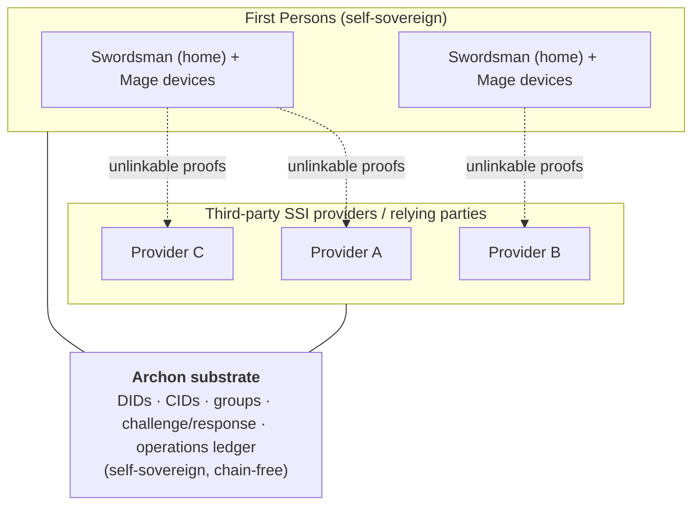
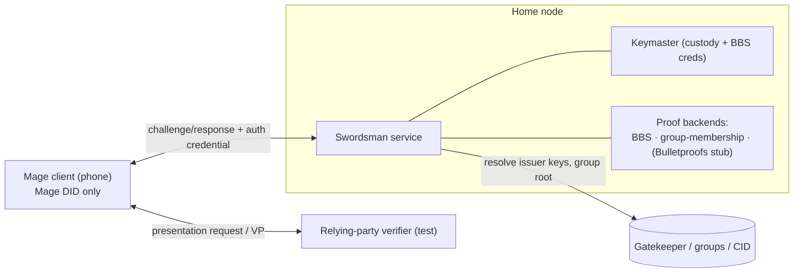

# Proposal: The Swordsman — Privacy-Preserving Authentication for the Archon Platform

**Audience:** Archon platform architecture · PVM / privacy stakeholders
**From:** Archon / Archetech
**Status:** Proposal for discussion
**Companion:** `SWORDSMAN_SERVICE_DESIGN.md` (full system design)

> **Thesis:** A user authenticates to a website from their phone — proving they're an authorized member — while revealing *nothing* about who they are, in a way no two sites can correlate, and **with no identity keys on the phone at all.** That single use case is impossible without zero-knowledge proofs, and Archon already has every other piece to deliver it.

---

## 1. The use case, in plain terms

You arrive at a site that requires membership. Your phone gets the site's challenge. You confirm with a fingerprint. Your **home Swordsman** — which holds your keys — mints a *fresh* zero-knowledge proof that says exactly one thing: *"the holder is an authorized member, signed by the issuer."* Your phone hands that proof to the site. Done.

What the site learns: you're a valid member. What it does **not** learn: which member, your identifier, any other attribute, or whether you've ever visited before. What never happened: no identity key ever touched your phone.

---

## 2. Why this needs ZKP

The instinct "do we really need ZK for this?" is fair — so here is the plain case. To prove "I'm an authorized member," the conventional options each fail on a different axis:

| Approach | Reveals identity? | Linkable across visits? | Keys on phone? |
|---|---|---|---|
| Log in / show identifier | **Yes** | **Yes** | — |
| Present the credential (even SD-JWT selective disclosure) | No | **Yes** — the issuer signature shows every time | — |
| Sign a challenge with the membership key | Identifies the key | **Yes** | **Yes** — and lose the phone, lose the identity |
| **ZK proof (BBS)** | **No** | **No** — each proof is unlinkable | **No** — minted at home, never on the phone |

Only the ZK path gives all three properties at once: reveal only the predicate, unlinkable across presentations, and (combined with the home-Swordsman split) **no signing key on the device you carry**. That combination is the product, and there is no non-ZK way to build it.

This is not academic. The cost it removes is concrete: every conventional option above hands sites a correlation handle that lets them — alone or together — rebuild a profile of the person. ZK is what makes "prove the fact, leak nothing else, can't be tracked" actually true rather than aspirational.

**And it's light on Archon.** BBS is IETF/W3C-standardized, hosted at DIF (our ecosystem), and needs **no trusted setup**. The Swordsman is **one optional service** in the existing satellite pattern (Herald, Drawbridge, Trust Registry) — not a rewrite. It reuses what we already ship: groups, challenge/response, DID resolution, and CIDs. And it stays **chain-free** — the proof math is local; the only external lookups (issuer keys, group roots) ride our existing DID-document and operations-ledger anchoring, so it keeps Archon's "no decentralized-network dependency" property intact.

---

## 3. How this composes with PVM

PVM and Archon are complementary layers with a clean separation of concerns, and the Swordsman is the integration point between them.

- **PVM owns the agent model and the privacy guarantees** — the Swordsman/Mage split and the conditional-independence property (the Gap, `s ⊥ m | X`, three-axis separation) that ensures no single party can reconstruct the person.
- **Archon owns the substrate** — DIDs and CIDs for addressing, groups and credentials for authorization data, challenge/response for transport, and the operations ledger for tamper-evidence without a runtime network. Self-sovereign and chain-free.
- **The Swordsman service is where they meet** — PVM's Swordsman *role* realized natively on Archon primitives.

The payoff for a multi-provider ecosystem: third-party SSI providers can interoperate over neutral, privacy-preserving, self-sovereign infrastructure with **no central operator able to correlate users**. To any provider, a First Person appears only as a minimal, unlinkable proof — the Swordsman guarantees that by construction.

Because the layers don't overlap, neither project has to absorb the other: PVM stays the privacy and agent model, Archon stays the substrate, and the Swordsman is the thin, well-defined seam between them.

---

## 4. Phase 1 — scope and design

**Goal.** Prove the headline use case end-to-end: a First Person authenticates to a relying party by proving *anonymous group membership* — revealing no identifier, unlinkable across presentations, with no identity keys on the device — via a home Swordsman that mints a fresh proof and a phone Mage that couriers it.

**Success criteria.** A demo in which (a) the Mage holds only its own DID, (b) the Swordsman mints a fresh BBS-derived membership proof bound to the relying party's nonce, delivered as a Verifiable Presentation, (c) the relying party verifies it against the *original issuer's* DID and the group's Merkle root, and (d) revoking the Mage's authorization credential immediately stops minting.

This is design only — the level below is the build prompt for tomorrow.

### 4.1 Components and responsibilities

- **Swordsman service** (holder-side, runs on the home node). Colocates a **Keymaster** (custody of identity keys and the BBS-secured credentials). Exposes a small DID-authenticated local/LAN API to its authorized Mage(s). On each request it: verifies the calling Mage, checks the Mage's authorization credential, evaluates the presence attestation against the request's consequence, mints a fresh proof bound to the relying party's presentation context, wraps it as a VP, and returns it. Single–First-Person; no multi-tenant state.
- **Proof backends** (inside the Swordsman, behind one proving interface). Phase 1 ships two: **BBS** (selective disclosure + unlinkable derived proof of a credential) and a **group-membership prover** (Merkle membership + nullifier over an Archon group, Semaphore-pattern). **Bulletproofs** is stubbed behind the same interface for range predicates but need not be wired to a demo path.
- **Mage client** (phone/device). Holds only its own Mage DID keypair. Receives the relying party's request, gathers an on-device presence attestation, authenticates to the Swordsman, relays the request + nonce, receives the VP, and presents it. Courier and presence terminal — never sees identity keys.
- **Authorization credential**. Issued by the First Person (via the Swordsman's Keymaster) to each Mage DID. The Swordsman demands it before minting and honors its revocation.
- **Relying-party verifier** (test harness for the demo). Issues a presentation request and verifies the returned VP against the issuer DID and group root. A minimal stand-in in Phase 1; OID4VP alignment is later.

### 4.2 Interfaces (named operations, no code)

- **Swordsman API** (DID-authenticated, local/LAN):
  - *request-presentation* — in: relying-party presentation request (assertion to prove, nonce, audience, disclosure spec) + Mage presence attestation; out: a VP wrapping the fresh derived proof bound to the nonce. Refuses if the Mage's authorization credential is missing/revoked or presence is insufficient for the request's consequence.
  - *list-provable* — in: nothing; out: the assertions the holder can currently prove (UX/menu).
- **Mage ↔ Swordsman** — Archon **challenge/response** (existing), carrying the above; the Swordsman's challenge demands the Mage's authorization credential (`create-challenge-cc`).
- **Mage ↔ relying party** — presentation request inbound, VP outbound (the two legs from the design doc).

### 4.3 Data objects (contents, not schemas)

- **Presentation request** — the assertion/predicate to prove, a nonce, the audience/domain, and a disclosure spec.
- **Presence attestation** — a signed "user present / check passed" with timestamp and the device Mage DID. Produced on-device; carries **no biometric template**.
- **Authorization credential** — subject = Mage DID; issuer = First Person; scope (what this Mage may request); validity window; revocation reference.
- **Output VP** — holder-bound (ephemeral) envelope wrapping the BBS-derived proof and a reference to the original issuer; bound to the request's nonce/audience. Not a newly issued VC (see the VC-vs-VP rule).
- **Group-membership anchor** — the Archon group's membership Merkle root, published as a CID and anchored via the operations ledger; the prover proves membership against it without revealing which member.

### 4.4 Dependencies — reused vs. new

- **Reused (existing Archon):** Keymaster (custody, BBS-secured credential issuance/holding), Gatekeeper (DID + group resolution, CID anchoring), Archon groups, challenge/response, operations-ledger anchoring.
- **New in Phase 1:** the Swordsman service process and proving interface; a BBS cryptosuite in the issue/derive path; the group-membership ZK prover over Archon groups; the Mage's on-device presence gate; authorization-credential issuance + check; VP wrapping bound to the verifier nonce.

### 4.5 Out of scope for Phase 1 (deferred, in the design doc)

Halo2 general predicates; CAEP transmitter for push revocation; threshold/MPC key splitting; STARKs / post-quantum; mission lifecycle; attenuated delegation/capability objects; full OID4VP conformance; multi–First-Person hosting; the offline degraded path.

### 4.6 Open decisions for the build session

- BBS library and curve binding; whether to lean on the W3C VC-DI-BBS cryptosuite directly.
- Group-membership construction: adapt a Semaphore-style circuit vs. a hand-rolled Merkle-membership + nullifier over Archon group state.
- VP envelope: which profile, and how the holder binding is carried (ephemeral key vs. the BBS presentation header).
- How the presence attestation is signed (Mage DID vs. a separate device key) and the consequence thresholds that gate it.
- Runtime: Rust service (aligns with the existing Rust Gatekeeper and the ZK ecosystem), with WASM prover support flagged for the in-browser wallet later.

---

## 5. Toward a DIF response

The DIF "Delegated Authority" threat model names a gap — execution-time governance of delegated authority, including *subject agency state* — and observes that every production answer to it lives in **centralized** identity platforms. This design occupies the white space: execution-time evaluation (the Swordsman mints only on current authorization), a presence/agency signal (on-device liveness), and proof-of-membership that is private by construction — all in a **self-sovereign** architecture.

That is the spine of a co-authored response: PVM's privacy model + Archon's self-sovereign substrate demonstrating, with running code, the governance layer the paper says nobody ships. The Swordsman is the proof of concept that makes the argument concrete rather than theoretical.
